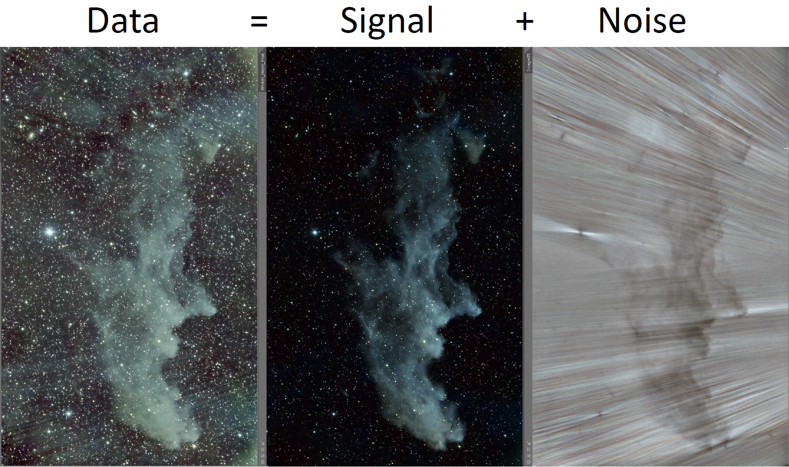
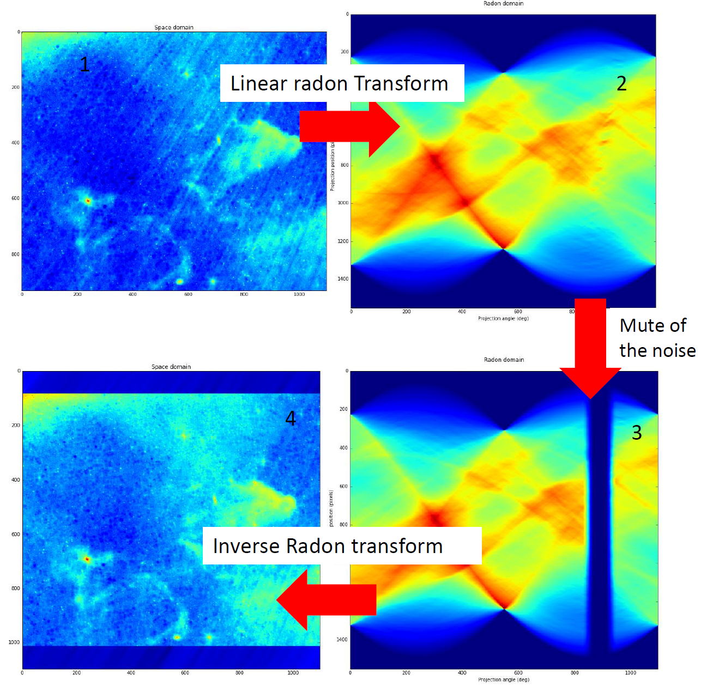

# Radial Noise Removal
An original method to remove radial noise in an image.

This is an original method to remove radial noise in an image, assuming the light radiates from a punctual source (a star), inside or outside the image. The image is sliced in small overlapping sub-windows. If the sub-windows are small enough, the noise can be approximated by quasi parallel lines in the window. The direction of the lines is computed from the coordinate of the punctual source, for each sub window. Then, under the above assumptions, the noise can be eliminated by the classical & well documented Tau-p (Radon transform) denoise in each window. The subwindows are then reassembled to form the denoised image.

For more details, visit:
https://erellaz.com/radial-noise-removal/

